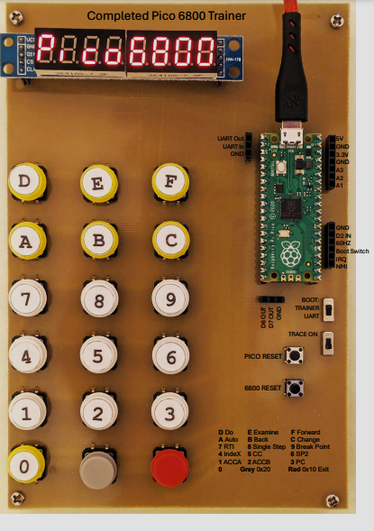
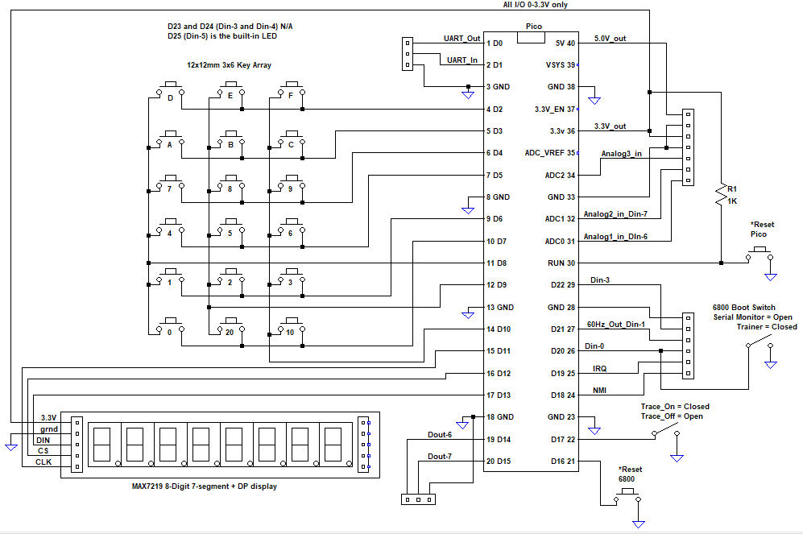

# 6800-Trainer
Pico based 6800 microprocessor trainer. Eight 7-segment displays. 18 key switches.

Drag sim680b_trainer_uart9600n.ino.uf2 into your Pico boot folder. Wire the switches and display
to start programming a 6800 simulated processor.

Also includes the picobug serial monitor, CNC PCB router/drill files.

Example code for message, 5 minute chess clock and a voltmeter.

.

.

New! Mini Pocket Trainer using 70x100mm board. Build files located in Mini Trainer folder.

.
